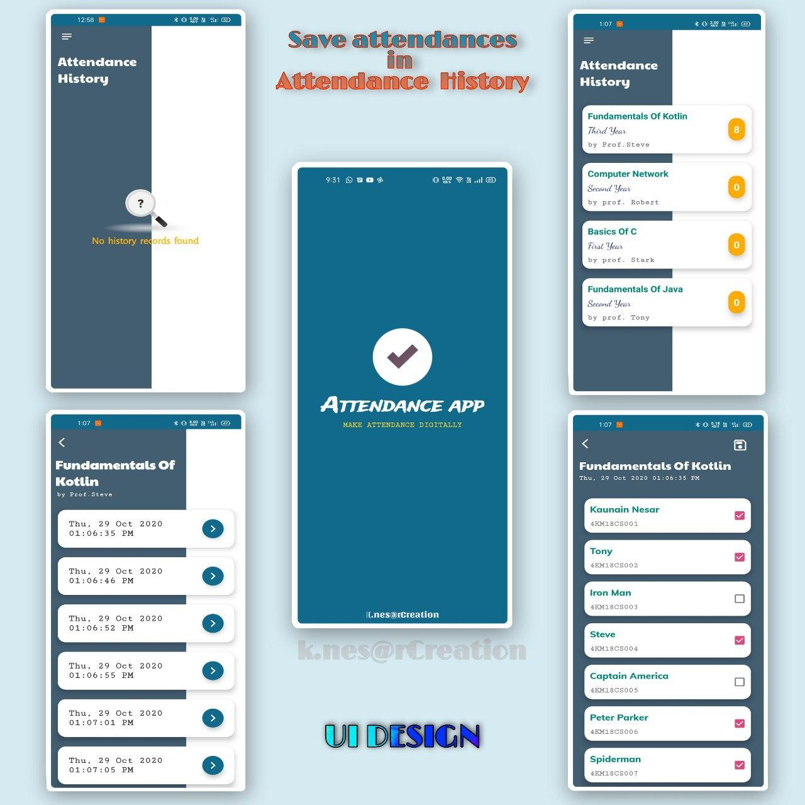
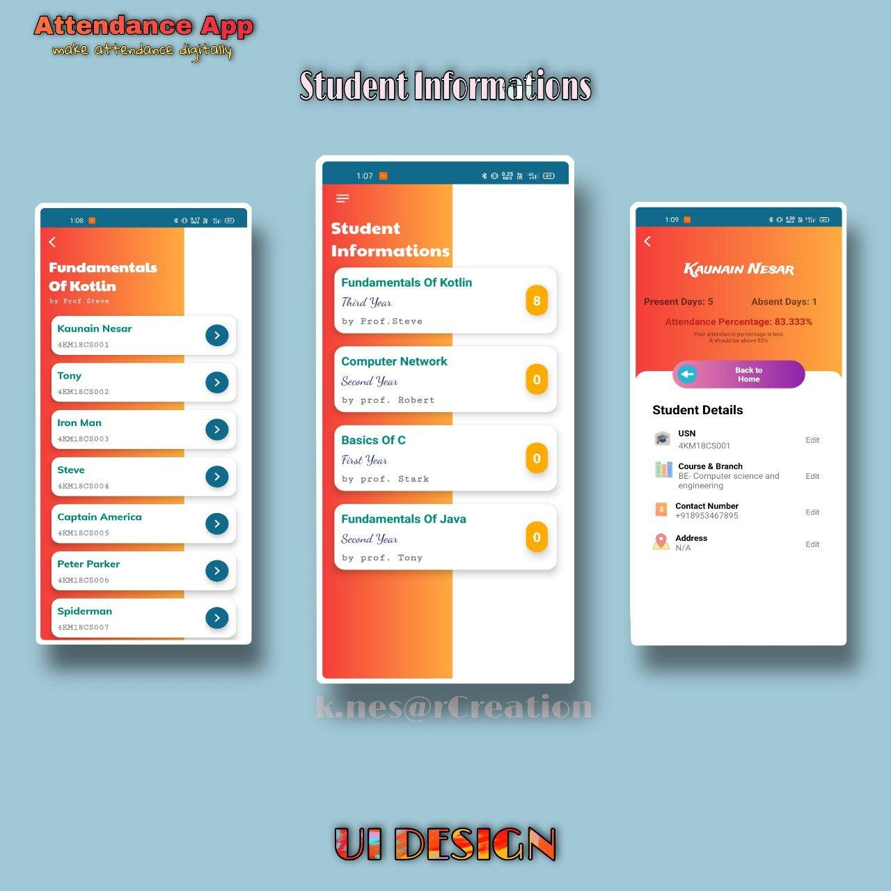

# Attendance_App
  * This is a simple and beautiful attendance app  with a user friendly UI
  * This app is made for **Colleges and schools students**
  * I tried to make a beautiful ui with transition effects , hope it will look attractive
  
  **Featues**
  1. All attendances will be saved in Attendance history as a past attendance 
  2. Past attendance can be modified further
  3. All students details can be stored in seprate fragment
  
  This app contains local database i.e., **Room database**, for saving all these attendances 
  
  Here are some screenshots
  
  
  
  
  
  
  **APP DEMO**
  Click here to Watch Demo
  
  
